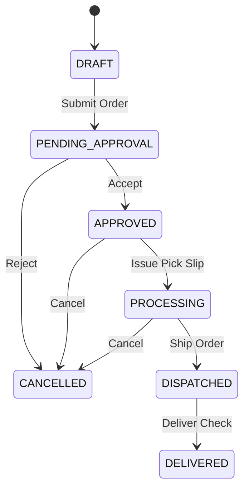

# Database Schema Specification: B2B Inventory & Ordering System

This document specifies the PostgreSQL relational database schema design, indexing strategies, audit models, and synchronization architectures for the B2B Inventory & Ordering Application.

---

## 1. DATABASE TABLES & COLUMNS

### Users Table (`users`)
*   **Purpose**: Stores authentication credentials, contact details, and role assignments.
*   **Columns**:
    *   `id` (`UUID`, PK, Required)
    *   `name` (`VARCHAR(255)`, Required)
    *   `email` (`VARCHAR(255)`, Unique, Required)
    *   `phone` (`VARCHAR(20)`, Optional)
    *   `password_hash` (`VARCHAR(255)`, Required)
    *   `role` (`VARCHAR(50)`, Required) - Enum values: `SUPER_ADMIN`, `STAFF`, `CUSTOMER`.
    *   `is_active` (`BOOLEAN`, Default `true`, Required)
    *   `created_at` (`TIMESTAMPTZ`, Default `NOW()`, Required)
    *   `updated_at` (`TIMESTAMPTZ`, Default `NOW()`, Required)

### Customers Table (`customers`)
*   **Purpose**: Stores B2B business profiles (Dealer/Buyer accounts) mapped to standard user login IDs.
*   **Columns**:
    *   `id` (`UUID`, PK, Required)
    *   `user_id` (`UUID`, FK `users.id`, Unique, Required)
    *   `company_name` (`VARCHAR(255)`, Required)
    *   `billing_address` (`TEXT`, Required)
    *   `shipping_address` (`TEXT`, Required)
    *   `gst_number` (`VARCHAR(15)`, Optional)
    *   `credit_limit` (`DECIMAL(12, 2)`, Default `0.00`, Required)
    *   `current_due_balance` (`DECIMAL(12, 2)`, Default `0.00`, Required)
    *   `assigned_staff_id` (`UUID`, FK `users.id`, Optional) - Represents the designated sales representative.

### Products Table (`products`)
*   **Purpose**: Stores parent product definitions (e.g., Handle Model A, Knob Model B).
*   **Columns**:
    *   `id` (`UUID`, PK, Required)
    *   `name` (`VARCHAR(255)`, Required)
    *   `description` (`TEXT`, Optional)
    *   `category` (`VARCHAR(100)`, Required)
    *   `image_url` (`VARCHAR(512)`, Optional)
    *   `is_active` (`BOOLEAN`, Default `true`, Required)
    *   `created_at` (`TIMESTAMPTZ`, Default `NOW()`, Required)
    *   `updated_at` (`TIMESTAMPTZ`, Default `NOW()`, Required)

### Product Variants Table (`product_variants`)
*   **Purpose**: Stores exact SKUs representing combinations of Size, Finish/Coating, and Pricing.
*   **Columns**:
    *   `id` (`UUID`, PK, Required)
    *   `product_id` (`UUID`, FK `products.id`, Required)
    *   `sku` (`VARCHAR(100)`, Unique, Required)
    *   `size` (`VARCHAR(50)`, Required) - e.g., "128mm", "1.5 inch".
    *   `finish` (`VARCHAR(50)`, Required) - e.g., "Black Matt", "Chrome".
    *   `unit_price` (`DECIMAL(10, 2)`, Required)
    *   `box_pack_qty` (`INT`, Default `1`, Required) - Standard quantity package size.
    *   `is_active` (`BOOLEAN`, Default `true`, Required)
    *   `version` (`BIGINT`, Default `1`, Required) - Optimistic locking field.

### Inventory Table (`inventory`)
*   **Purpose**: Tracks stock counts for each product variant SKU.
*   **Columns**:
    *   `id` (`UUID`, PK, Required)
    *   `variant_id` (`UUID`, FK `product_variants.id`, Unique, Required)
    *   `physical_stock` (`INT`, Default `0`, Required) - Total units physically present.
    *   `reserved_stock` (`INT`, Default `0`, Required) - Units allocated to unfulfilled orders.
    *   `warehouse_location` (`VARCHAR(100)`, Optional) - Text indicating storage rack/location.

### Orders Table (`orders`)
*   **Purpose**: Parent headers representing transaction orders.
*   **Columns**:
    *   `id` (`UUID`, PK, Required)
    *   `order_number` (`VARCHAR(50)`, Unique, Required) - e.g., "ORD-10024".
    *   `customer_id` (`UUID`, FK `customers.id`, Required)
    *   `created_by` (`UUID`, FK `users.id`, Required) - Sales staff or customer ID.
    *   `status` (`VARCHAR(50)`, Required) - Enum values: `DRAFT`, `PENDING_APPROVAL`, `APPROVED`, `PROCESSING`, `DISPATCHED`, `DELIVERED`, `CANCELLED`.
    *   `total_amount` (`DECIMAL(12, 2)`, Required)
    *   `payment_terms` (`VARCHAR(100)`, Default "Credit", Required)
    *   `offline_client_id` (`UUID`, Unique, Optional) - Used to prevent double insertions during offline sync.
    *   `created_at` (`TIMESTAMPTZ`, Default `NOW()`, Required)
    *   `updated_at` (`TIMESTAMPTZ`, Default `NOW()`, Required)

### Order Items Table (`order_items`)
*   **Purpose**: Line-items mapping variant SKUs, order quantities, and custom contract rates.
*   **Columns**:
    *   `id` (`UUID`, PK, Required)
    *   `order_id` (`UUID`, FK `orders.id`, Required)
    *   `variant_id` (`UUID`, FK `product_variants.id`, Required)
    *   `quantity` (`INT`, Required)
    *   `unit_price` (`DECIMAL(10, 2)`, Required)
    *   `allocated_quantity` (`INT`, Default `0`, Required) - Allocated from physical stock.
    *   `backorder_quantity` (`INT`, Default `0`, Required) - Awaiting production/refill.

---

## 2. RELATIONSHIPS MAP

*   **One-to-One**:
    *   `users` $\leftrightarrow$ `customers` (`customers.user_id` has a unique constraint to `users.id`).
    *   `product_variants` $\leftrightarrow$ `inventory` (`inventory.variant_id` has a unique constraint to `product_variants.id`).
*   **One-to-Many**:
    *   `products` $\rightarrow$ `product_variants` (`product_variants.product_id` references `products.id`).
    *   `customers` $\rightarrow$ `orders` (`orders.customer_id` references `customers.id`).
    *   `orders` $\rightarrow$ `order_items` (`order_items.order_id` references `orders.id`).
*   **Many-to-Many**: Represented by Junction table mappings (e.g. `order_items` acts as a many-to-many lookup between `orders` and `product_variants`).

---

## 3. INDEXING STRATEGY

*   **Primary Keys (PKs)**: Automated B-tree indexes generated on all `id` (UUID) columns.
*   **Foreign Keys (FKs)**: Explicit B-tree indexes created to speed up join queries:
    *   `idx_customers_user_id` on `customers(user_id)`
    *   `idx_variants_product_id` on `product_variants(product_id)`
    *   `idx_orders_customer_id` on `orders(customer_id)`
    *   `idx_order_items_order_id` on `order_items(order_id)`
*   **Search / Performance Indexes**:
    *   `idx_products_name_trgm` - GiST index on `products(name)` for fuzzy text searching.
    *   `idx_variants_sku` - Unique index on `product_variants(sku)`.
    *   `idx_orders_status_created` - Composite index on `orders(status, created_at DESC)` to accelerate admin dashboard filtered queries.

---

## 4. INVENTORY MODEL CALCULATIONS

The inventory engine calculates stock availability dynamically:

$$\text{Available Stock} = \text{Physical Stock} - \text{Reserved Stock}$$

### Definitions:
*   **Physical Stock**: The absolute quantity of physical goods currently stored in the building.
*   **Reserved Stock**: Stock committed to unfulfilled, approved orders (`status IN ('APPROVED', 'PROCESSING')`).
*   **Available Stock**: Stock free to be allocated to incoming sales orders.

### Calculation Code / Logic:
When an order item is created/approved for $N$ quantity:
1.  Verify: $\text{Available Stock} \ge N$.
2.  If yes: Allocate $N$ (Set `allocated_quantity = N`), increment `reserved_stock` by $N$ inside `inventory`.
3.  If no: Allocate available amount $A$ (where $A = \text{Available Stock}$), set `allocated_quantity = A`, set `backorder_quantity = N - A`, and increment `reserved_stock` by $A$.

---

## 5. ORDER STATE TRANSITIONS

The system restricts status transitions according to the state machine diagram:



---

## 6. LEDGER MODEL

The `customer_ledger` table serves as the double-entry accounting source of truth.

### Customer Ledger Table (`customer_ledger`)
*   **Columns**:
    *   `id` (`UUID`, PK, Required)
    *   `customer_id` (`UUID`, FK `customers.id`, Required)
    *   `entry_date` (`TIMESTAMPTZ`, Default `NOW()`, Required)
    *   `entry_type` (`VARCHAR(20)`, Required) - Enum: `DEBIT` (Charge, e.g. Invoice issued), `CREDIT` (Payment received, e.g. Cash collected).
    *   `reference_invoice_id` (`UUID`, FK `invoices.id`, Optional)
    *   `amount` (`DECIMAL(12, 2)`, Required)
    *   `running_balance` (`DECIMAL(12, 2)`, Required) - Customer due balance post-entry.

### Balance Calculation Rule:
$$\text{Outstanding Balance} = \sum(\text{Debit Amounts}) - \sum(\text{Credit Amounts})$$

---

## 7. INVOICE MODEL

### Invoices Table (`invoices`)
*   **Columns**:
    *   `id` (`UUID`, PK, Required)
    *   `invoice_number` (`VARCHAR(50)`, Unique, Required) - e.g., "INV-10024".
    *   `order_id` (`UUID`, FK `orders.id`, Required)
    *   `customer_id` (`UUID`, FK `customers.id`, Required)
    *   `taxable_value` (`DECIMAL(12, 2)`, Required)
    *   `gst_value` (`DECIMAL(12, 2)`, Required)
    *   `total_amount` (`DECIMAL(12, 2)`, Required)
    *   `pdf_storage_url` (`VARCHAR(512)`, Required) - Link to PDF file hosted on Amazon S3 object storage.
    *   `created_at` (`TIMESTAMPTZ`, Default `NOW()`, Required)

---

## 8. OFFLINE SYNC SUPPORT

To support offline changes, the tables: `orders`, `order_items`, and `customer_ledger` store the following sync attributes:
*   `client_last_updated_at` (`TIMESTAMPTZ`): Device local modification timestamp.
*   `server_last_synced_at` (`TIMESTAMPTZ`): Timestamp when synced with cloud database.
*   `offline_client_id` (`UUID`): Prevents duplicate orders if connection drops mid-upload.

---

## 9. IMMUTABLE AUDIT LOG DESIGN

To ensure data integrity, audit logs are stored in an append-only table.

### Audit Log Table (`audit_logs`)
*   **Columns**:
    *   `id` (`BIGINT`, PK, Auto-increment)
    *   `user_id` (`UUID`, FK `users.id`, Required)
    *   `action` (`VARCHAR(50)`, Required) - e.g., "INVENTORY_ADJUST", "INVOICE_CREATE".
    *   `table_name` (`VARCHAR(100)`, Required)
    *   `record_id` (`UUID`, Required)
    *   `old_values` (`JSONB`, Optional)
    *   `new_values` (`JSONB`, Optional)
    *   `ip_address` (`INET`, Optional)
    *   `created_at` (`TIMESTAMPTZ`, Default `NOW()`, Required)

*   **Security Policy**: Deny all `UPDATE` and `DELETE` queries on `audit_logs` using PostgreSQL Rules/Triggers.

---

## 10. POSTGRESQL OPTIMIZATION

1.  **Row Locking (Concurrency Control)**: When modifying stock, use:
    ```sql
    SELECT * FROM inventory 
    WHERE variant_id = $1 
    FOR UPDATE;
    ```
    This prevents race conditions between simultaneous orders.
2.  **Audit JSONB Compression**: Use `JSONB` format for `old_values`/`new_values` in `audit_logs` to enable fast indexing and compression of audit trail payloads.
3.  **Table Partitioning**: Range-partition the `audit_logs` and `customer_ledger` tables by `created_at`/`entry_date` yearly to maintain fast queries as data grows over 10 years.
