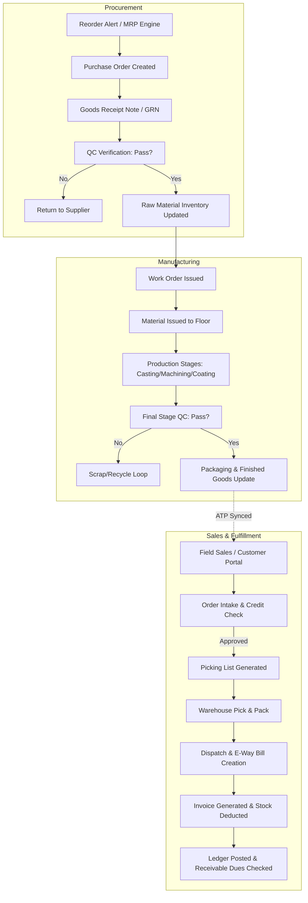

# Hardware Fittings Manufacturing ERP & WMS: Product Architecture Blueprint

This document specifies the ideal business processes, user roles, system workflows, and inventory/warehouse frameworks for a modern Hardware Fittings Manufacturing Enterprise Resource Planning (ERP) and Warehouse Management System (WMS) designed to scale for the next 10 years.

---

## 1. BUSINESS PROCESS MAPPING

A modern hardware manufacturing business operates a continuous loop of materials, labor, and financial transactions. Below is the mapping of core business processes.

### Raw Material Procurement
*   **Process**: Requisition, Vendor RFQ, Purchase Order (PO) creation, Goods Receipt Note (GRN) entry, Quality Check of incoming raw material, and supplier invoice registration.
*   **Key Inputs**: Bill of Materials (BOM) thresholds, minimum order quantities (MOQ), and raw materials (e.g., zinc alloy, brass rods, stainless steel coils, powders/paints, magnets, packaging boxes).
*   **Key Outputs**: Approved vendor lists, active POs, incoming stock adjustments, and accounts payable entries.

### Inventory Management
*   **Process**: Real-time tracking of raw materials (RM), Work-in-Progress (WIP) parts (e.g., casted handles before polishing or powder coating), and Finished Goods (FG).
*   **Key Inputs**: Material transfers, production scrap reports, physical stock audits.
*   **Key Outputs**: Real-time stock valuation, inventory turn ratios, and automated reorder alerts.

### Production Planning
*   **Process**: Material Requirements Planning (MRP), Work Order (WO) generation, machine routing, and labor assignment.
*   **Key Inputs**: Confirmed customer sales orders, current FG stock, and machine capacity.
*   **Key Outputs**: Weekly/daily production schedules and material dispatch notes to the foundry/press shop.

### Manufacturing
*   **Process**: Die-casting, stamping, CNC machining, polishing, plating/powder coating, assembly, and packaging.
*   **Key Inputs**: Raw materials, energy consumption logs, and employee clock-in hours.
*   **Key Outputs**: Work-in-progress logs, production run counts, and scrap reporting.

### Quality Control (QC)
*   **Process**: Stage-gate inspections (post-casting, post-plating, pre-packaging) and scrap control.
*   **Key Inputs**: QC specification sheets, dimensional tolerances, and visual finish guidelines.
*   **Key Outputs**: Passed/failed batch logs, quarantine logs, and vendor quality scorecards.

### Finished Goods Inventory
*   **Process**: Storing fully packaged hardware items in designated warehouse bins.
*   **Key Inputs**: QC pass logs, packaging transfer records.
*   **Key Outputs**: Available-to-Promise (ATP) stock counters synced with the sales team's mobile devices.

### Order Management
*   **Process**: Order taking (B2B field sales or customer portal), credit limit validation, delivery commitments, and shipping planning.
*   **Key Inputs**: Customer accounts, wholesale price lists, and ATP stock levels.
*   **Key Outputs**: Confirmed sales orders, picking lists, and order priority logs.

### Dispatch
*   **Process**: Pick list validation, packaging slip creation, vehicle/courier assignment, and gate-out logs.
*   **Key Inputs**: Pick lists, transporter details, weight bridges.
*   **Key Outputs**: Lorry Receipts (LR), packing lists, and inventory deduction logs.

### Billing & Invoicing
*   **Process**: Generating tax invoices, applying GST/duties, calculating bulk discounts, and recording accounts receivable.
*   **Key Inputs**: Dispatched items list, active customer contract pricing.
*   **Key Outputs**: Signed Tax Invoices, e-way bills (where applicable), and financial ledger updates.

### Customer Ledger
*   **Process**: Real-time ledger maintenance, payment receipts, debit/credit note adjustments, and aging accounts receivable alerts.
*   **Key Inputs**: Payment records (cheque, bank transfer, digital payment) and invoices.
*   **Key Outputs**: Aging reports, statement statements, and credit score updates.

---

## 2. USER ROLES & ACCESS MATRIX

| User Role | Description | Core Responsibilities | System Access Permissions |
| :--- | :--- | :--- | :--- |
| **Super Admin** | Full system controller | Customizations, API integrations, global settings | CRUD on all models, database backups, audit logs |
| **Factory Owner** | Business Director | High-level analytics, approvals, financial audits | Read access to all; approval rights on credit limits & budgets |
| **Production Manager** | Shop floor lead | BOM maintenance, work orders, scheduling, machine allocation | Read/Write on BOM, Work Orders, Production Logs, QC Schedules |
| **Warehouse Manager** | WMS controller | Inventory levels, picking/packing, dispatch, goods receipt | Read/Write on WMS, GRN, Transfer Orders, Stock Audits |
| **Sales Executive** | Field sales representative | Client visits, customer onboarding, order booking, collections | Read catalog/ATP; Read/Write on Orders, Lead Logs, Collection receipts |
| **Accountant** | Financial controller | Ledger management, invoicing, tax, vendor payments | Read/Write on Ledger, Invoices, Receipts, Supplier bills |
| **Customer** | End B2B client | Direct self-service ordering, tracking, ledger review | Read catalog; Read/Write own profile, orders, pay balance |

---

## 3. END-TO-END MANUFACTURING WORKFLOW



---

## 4. MISSING FEATURES FROM LEGACY APPLICATION
Compared to the basic ordering app, a real manufacturing ERP must include:

1.  **Bill of Materials (BOM) System**: Defining raw material formulations for each size of handle or knob.
2.  **Work-in-Progress (WIP) Tracking**: Real-time status of metal casting, polishing, electroplating, and powder coating stages.
3.  **Advanced Pricing Engines**: Multi-tier wholesaler, distributor, and retail pricing configurations, including volume-based discounts.
4.  **Multi-Warehouse & Bin Locations**: Ability to view and allocate stock from specific locations, zones, or shelves.
5.  **Quality Control Management**: Automated checklists, quarantine areas, and test certificates for batches.
6.  **Batch & Serial Number Tracking**: Crucial for tracking plating defects back to chemical bath batches.
7.  **Barcode / QR Scanning**: Native mobile scanner integration for picking, stock transfers, and deliveries.
8.  **Automated Billing & Digital Invoices**: Auto-generation of PDFs, e-invoices, and e-way bills from order dispatch lists.

---

## 5. REBUILD ROADMAP: MVP VS. FUTURE RELEASES

```carousel
### MVP (V1) - Core Operations
*   **Security & Auth**: OAuth2 authentication with basic user roles (Admin, Sales, Accountant, Customer).
*   **Inventory & Products**: Product Catalog with hierarchical categories, custom size grids, and real-time Available-to-Promise (ATP) stock levels.
*   **Order Intake**: B2B customer order booking (offline support for Sales Execs), credit limit warnings.
*   **Simple Billing & Ledger**: Invoice creation, PDF export, basic accounts receivable ledger list, and transaction receipts.
*   **Basic GRN**: Log incoming raw materials and update stock manually.
<!-- slide -->
### Phase 2 (V2) - Production & WMS
*   **BOM & Production Orders**: Define recipes, issue work orders, and log daily yields.
*   **WMS Bin Management**: Implement zones, bins, and barcode/QR scanning for stock movements (Putaway/Picking).
*   **QC Module**: Inspection checkpoints post-plating/coating, handling quarantine and scrap logs.
*   **Payments Integration**: In-app digital payments (UPI, card, ACH) for ledger settlement.
<!-- slide -->
### Phase 3 (V3) - Scale & Automation
*   **AI Demand Forecasting**: Predictive manufacturing schedules based on historical order trends and seasonal demands.
*   **IoT Shop-floor Integration**: Connect to die-casting or CNC machines for automated cycle counts and down-time reporting.
*   **Tax/Gov Integration**: Native API connections for E-Invoice and E-Way bill generation.
```

---

## 6. INVENTORY & PRODUCT HIERARCHY

The product catalog requires a clean hierarchy to avoid duplicated SKUs for various colors, sizes, and coatings.

```
[Category] 
   └── [Sub-Category]
          └── [Product Family (Parent SKU)]
                 └── [Variant SKU] (Combination of Size, Finish/Coating, Packaging)
```

### Hierarchy Breakdown:
1.  **Category**: e.g., `Cabinet Hardware`, `Door Hardware`.
2.  **Sub-Category**: e.g., `Handles`, `Knobs`, `Kadi`.
3.  **Product Family**: e.g., `D-Handle Curved Model 204`.
4.  **Variant SKU (Level of Purchase)**: e.g., `HDL-204-SS-128MM-BOX24` (Handle Model 204, Stainless Steel Finish, 128mm Hole-to-Hole Size, Packed in 24-unit boxes).

### Product Attribute Model:
*   **Base Attributes**: SKU, Item Name, Base Unit of Measure (UOM), Product Family, Weight (g), Dimensions, Minimum Stock Level.
*   **Dynamic Attributes (Variant specific)**:
    *   *Finish/Coating*: Chrome Plated, Black Matt, White Satin, Brass Antique.
    *   *Dimensions*: Width, Length, Hole Pitch (e.g. 96mm, 128mm, 160mm).
    *   *Pack Unit*: Single unit, Box of 10, Box of 50.

---

## 7. WAREHOUSE MANAGEMENT STRUCTURE (WMS)

To prevent misplaced parts and ensure rapid order picking, the warehouse is split into physical locations tracked by the ERP:

```
[Warehouse] ── [Zone] ── [Aisle] ── [Rack / Shelf] ── [Bin Location]
```

### Location Mapping Matrix:
*   **Warehouse Code**: e.g., `WH-01` (Main Finished Goods Factory Warehouse), `WH-02` (Raw Material Yard).
*   **Zone Types**:
    *   *RM*: Raw Material Storage (Steel coils, rods, zinc blocks).
    *   *WIP*: Work in Progress (Casting completed, awaiting powder coating).
    *   *FG*: Finished Goods (Packaged, ready-to-ship handles).
    *   *QC*: Quality Inspection & Quarantine Zone.
*   **Aisle / Rack / Bin**: e.g., `FG-A03-S2-B08` (Finished Goods Zone, Aisle A03, Shelf 2, Bin Location 8).

### Picking & Putaway Flow:
1.  **System-Directed Putaway**: Upon QC passage, the system matches the product SKU with historical bin locations and designates the target Bin QR Code. The warehouse worker scans the item and the bin to complete the putaway.
2.  **Optimized Picking Paths**: When an order is released, the system aggregates the line items and prints/displays a picking list sorted by Aisle/Rack sequences, minimizing walking distance.

---

## 8. OFFLINE-FIRST ARCHITECTURE FOR FIELD SALES

Field sales staff operate in industrial yards, remote towns, or manufacturing sites with intermittent internet connections. The app must run offline-first.

```
┌────────────────────────────────────────────────────────┐
│                   Field Sales Mobile Client            │
│  ┌───────────────────────┐   ┌───────────────────────┐ │
│  │     UI Components     │   │   Offline database    │ │
│  │ (Catalog, Cart, Dues) │◀─▶│ (Encrypted SQLite/SQL)│ │
│  └───────────────────────┘   └───────────────────────┘ │
└───────────────────────────────▲────────────────────────┘
                                │
                        Sync Engine / Queue
                                │   (HTTPS API)
                                ▼
┌────────────────────────────────────────────────────────┐
│                   ERP Backend Server                   │
└────────────────────────────────────────────────────────┘
```

### 1. Data Replication Model:
*   **Static/Reference Data (Downloaded during Sync/Startup)**:
    *   Party/Client Master (Names, credit limits, pricing tier, addresses).
    *   Product Master (Names, variants, sizes, standard prices).
*   **Dynamic Data (Local Cache with Server Validation)**:
    *   ATP Stock counts (Timestamped).
    *   In-app current Cart / Order draft.

### 2. Transaction Queue & Conflict Resolution Strategy:
*   **The Queue**: Tapping "Confirm Order" while offline logs the order status as `Queued / Draft` in local storage.
*   **Background Worker**: The sync service runs in the background. When network status switches to active:
    1.  The sync worker uploads queued orders sequentially.
    2.  The server validates pricing and stock availability (ATP check).
    3.  If stock is available, the server locks the stock and changes the status to `Confirmed`.
*   **Conflict Resolution Protocol**:
    *   *Pricing Mismatches*: If the local price was out-of-date, the order is registered with a `Price-Warning Flag` and routed to the Accountant for manual review, preventing billing disputes.
    *   *Stock Stockouts*: If the item sold out before the sync completed, the system notifies the sales rep via push notification, changing the order status to `Partially Allocated / Pending Allocation` and placing the remaining items in a backorder queue.
