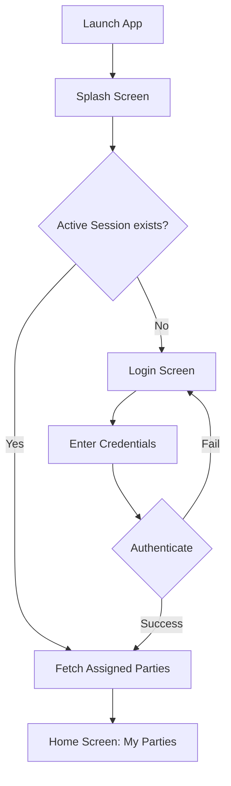
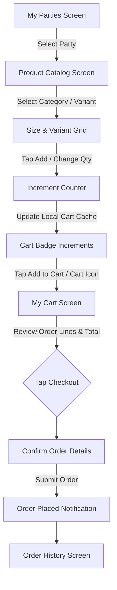
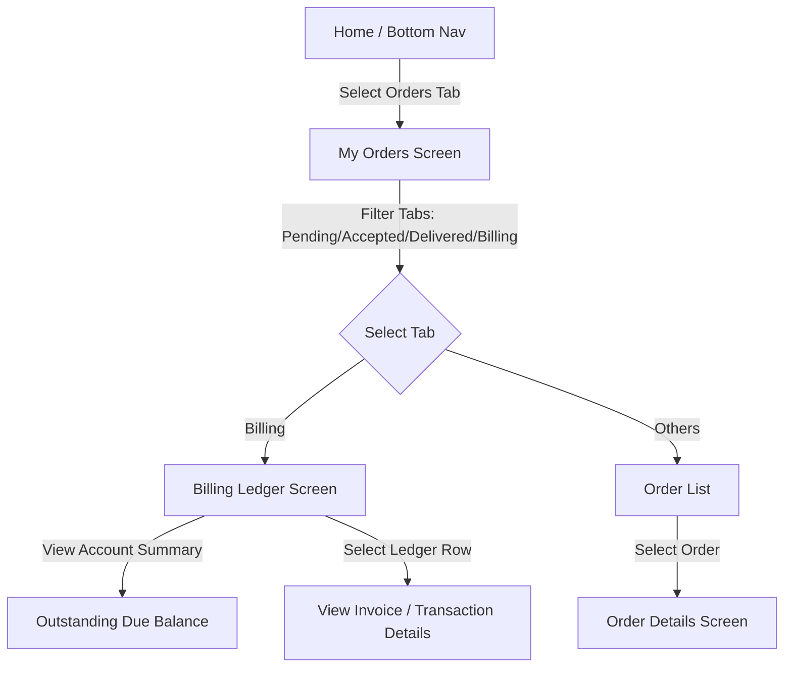

# Coating House Inventory Mobile Application: Analysis and Rebuild Report

This document presents a exhaustive analysis of the legacy Coating House mobile application based on the reference video `VID-20260622-WA0005.mp4`. It outlines the existing features, gaps, flows, and recommends a modern, secure, and performant architecture for the rebuilt application.

---

## PART 1 - FEATURE INVENTORY

### 1. Splash Screen & Brand Identity
*   **Purpose**: Introduces the user to the brand and displays a loading screen during startup initialization.
*   **Business Value**: Establishes brand presence ("Coating House - Fast service with best quality").
*   **User Roles Involved**: All users (Customers/Agents).
*   **Missing Functionality**: No option to bypass, check connectivity, auto-update check, or show active loading state if initialization stalls.
*   **Suggested Improvements**: Add animation, verify session integrity in the background, and provide a offline-graceful timeout.

### 2. Party / Customer Selection ("My Parties")
*   **Purpose**: Allows sales reps or distributors to choose which client profile ("Party") they are booking orders for.
*   **Business Value**: Ensures orders are mapped to the correct wholesale account, pricing tier, and shipping address.
*   **User Roles Involved**: Sales Representatives, Distributors, Agents.
*   **Missing Functionality**: Search bar, categorizations/filters (by city, status, outstanding balance), pagination, and map integration.
*   **Suggested Improvements**: Implement a fuzzy search bar, sorting options (e.g., "Recently Visited", "High Outstanding Balance"), and a map view to locate parties nearby.

### 3. Product Catalog with Variant Grid
*   **Purpose**: Displays available hardware accessories (Handles, Knobs, Keystands, Khuti, Patty, Kadi, Megnets) and allows selecting specific sizes/colors for ordering.
*   **Business Value**: Primary interface for order generation.
*   **User Roles Involved**: Sales Reps, Distributors, Warehouse Staff.
*   **Missing Functionality**: Real-time stock counts (in-stock vs. out-of-stock), unit price visibility before adding to cart, product descriptions, materials info, image expand/zoom, and search/filtering.
*   **Suggested Improvements**: Integrate live stock numbers, show price-per-unit, add product searching/filtering, and allow grid or list layouts.

### 4. Shopping Cart Management
*   **Purpose**: Holds selected items, sizes, and quantities prior to order checkout.
*   **Business Value**: Prevents accidental orders, aggregates order lines, and summarizes total quantities and weights.
*   **User Roles Involved**: Sales Reps, Distributors, Customers.
*   **Missing Functionality**: Order note field, delivery date preference, individual item price breakdowns, weight calculations, bulk item deletion, and edit-in-cart controls.
*   **Suggested Improvements**: Display complete price breakdowns (taxes, discounts), show estimated delivery dates, and allow saving carts as templates for recurring orders.

### 5. Order History & Status Tracking
*   **Purpose**: Displays past orders grouped by status tabs: All, Pending, Accepted, Delivered, and Billing.
*   **Business Value**: Provides self-service tracking, minimizing customer support queries about delivery status.
*   **User Roles Involved**: Customers, Sales Reps, Support Agents.
*   **Missing Functionality**: Cancel Order button for pending orders, detailed progress tracking (e.g., "In Production", "Out for Delivery"), courier tracking links, and easy reorder/duplicate order buttons.
*   **Suggested Improvements**: Add timeline stages, push notifications on status changes, and a single-tap "Reorder" button.

### 6. Billing Ledger & Financial Outstanding
*   **Purpose**: Displays the account summary showing Due Balance, Total Debit, Total Credit, and a ledger of recent order payments.
*   **Business Value**: Streamlines collections, alerts users to unpaid invoices, and reduces billing disputes.
*   **User Roles Involved**: Accounts Team, Customers, Sales Reps.
*   **Missing Functionality**: Payment gateway integration to settle dues, PDF invoice downloads, search ledger by transaction date/type, and support for credit notes/adjustments.
*   **Suggested Improvements**: Add "Pay Now" UPI/Netbanking button, generate and share PDF statements, and highlight overdue invoices in red.

### 7. Profile & Account Settings
*   **Purpose**: Manages personal profile details, passwords, addresses, and account deletion.
*   **Business Value**: Maintains security compliance and accurate shipping records.
*   **User Roles Involved**: All Registered Users.
*   **Missing Functionality**: Multiple delivery addresses, profile photo upload, notification settings, and two-factor authentication (2FA).
*   **Suggested Improvements**: Support address selection from map pins, enable biometrics login, and provide a granular notifications toggle.

---

## PART 2 - USER FLOW ANALYSIS

### Flow Diagrams (Mermaid)

#### 1. Authentication & Launch Flow

#### 2. Ordering & Product Selection Flow

#### 3. Order Tracking & Billing Ledger Flow

---

## PART 3 - SCREEN INVENTORY

| Screen Name | Main Purpose | Inputs | Outputs | Validation Rules | Improvement Opportunities |
| :--- | :--- | :--- | :--- | :--- | :--- |
| **Splash Screen** | Display brand logo and check application state | None | Brand logo, loading spinner | Check for app updates and network connection | Add animation and session check progress indicator |
| **My Parties (Home)** | Select active client account for order placement | Select party row | List of assigned parties (Name, City, Phone) | None visible; toast displays fetch status | Add search bar, sorting, filtering, and customer contact shortcut buttons |
| **Product Catalog** | Browse products and add items to cart | Tapping variants, quantities (+/-) | Variant selectors, size grids, cart counter | Cart quantity cannot be negative | Show prices, real-time stock availability, and allow adding custom sizes or finishes |
| **My Cart** | Review and modify selected items before submission | Quantity changes, item deletion | List of cart items, quantities, and totals | Minimum order limits or package sizes validation | Add delivery preference, custom instruction inputs, and price breakdowns |
| **My Orders** | View current and past orders status | Status tab selector (All, Pending, Accepted, Delivered, Billing) | Status filtered order list (Order #, Date, Items, Amount) | Status transitions are read-only | Implement search by Order ID, date range filter, and progress timeline |
| **Billing Ledger** | Monitor outstanding balances and transaction history | Expandable transaction rows | Account Summary (Due, Debit, Credit), transaction list | Dues calculated server-side | Add "Pay Now" option, print/export statements, and filter by payment type |
| **Profile** | Manage account settings and user profile details | Address input, password updates | Profile details (Name, Email, Mobile, Gender) | Form field formats (Email validation, Phone number length) | Integrate biometrics setup, multi-address profile, and notification logs |

---

## PART 4 - UX REVIEW

| Evaluated Area | Rating (1-10) | Critique and Observations |
| :--- | :--- | :--- |
| **Navigation** | **5 / 10** | The bottom navigation provides quick tab changes, but back navigation from the product catalog is inconsistent and lacks a clear contextual breadcrumb. |
| **Information Architecture** | **6 / 10** | Category structure is simple, but missing search features makes finding specific sizes or product types cumbersome as inventory grows. |
| **Form Design** | **4 / 10** | Adding items uses simple `+ / -` grids, but has no typing inputs for bulk quantities (e.g. entering 100 units requires 100 taps or multiple clicks of package boxes). |
| **Accessibility** | **3 / 10** | Small text sizes, low-contrast UI components, and absence of screen reader accessibility hooks make this difficult for visually impaired users. |
| **Usability** | **5 / 10** | High learning curve due to missing visual guidance on what dimensions represent (e.g., handles sizes in mm or inches) and no product prices on product lists. |
| **Mobile-first Experience**| **6 / 10** | Layout is responsive to standard screens, but lacks optimization for one-handed operation (e.g. "Add to Cart" button placement is high up or needs long reaches). |

---

## PART 5 - INVENTORY DOMAIN REVIEW

### 1. Supported Business Type
The app appears to support a **hardware/metal fittings manufacturing and finishing/powder-coating service**. Product types (e.g., `HANDLE`, `KNOB`, `KEYSTAND`, `KHUTI`, `PATTY`, `KADI`, `MEGNET`) and the business name `COATING HOUSE` indicate specialized hardware parts that are manufactured, electroplated, or powder-coated in bulk batches with customized sizes and finishes (like Black Matt, Gray, White Sartin).

### 2. Missing Inventory Best Practices
*   **Real-time Stock Allocation**: No display of current physical stock or production availability, which leads to backorders and order fulfillment delays.
*   **SKU Management**: Products lack visible unique SKUs (Stock Keeping Units), causing potential packing errors in the warehouse.
*   **Batch / Lot Tracking**: In a coating business, batches of paint, powder, or chemicals vary. There is no traceability showing which batch of paint was applied to which order.

### 3. Missing Warehouse Features
*   **Bin Location / Warehouse Shelving**: No warehouse mapping layout to guide workers to the exact location of `KADI` or `KHUTI` items.
*   **Barcode Scanning**: Lacks camera-based barcode/QR code scanner support for picking, packing, and dispatch validation.
*   **Quality Inspection Gate**: No stage for quality control checklist before order dispatch.

### 4. Missing Audit Features
*   **Stock Take / Inventory Audits**: No feature to perform cycle counting or physical stock matching against system inventory.
*   **Chain of Custody Tracking**: No audit trail documenting which packer, loader, or delivery agent handled the goods.

### 5. Missing Reporting Features
*   **Demand Forecasting**: No reports identifying top-selling styles, finishes, or seasonal volume spikes.
*   **Dead Stock / Aging Reports**: No warnings for products occupying shelf space without sales turnover.

---

## PART 6 - SECURITY REVIEW

### 1. Key Security Risks
*   **Data Leakage via Client-side Storage**: If credentials, party mappings, and invoices are cached in local storage/SQLite without encryption, root/jailbroken devices can access sensitive corporate data.
*   **Price Manipulation Vulnerability**: Since price calculations are shown on the client side, compromised APIs might allow submitting orders with modified rates if the backend does not validate line-item prices on submission.
*   **Lack of Input Sanitization**: Form inputs in search fields or custom address forms might be vulnerable to SQL injection or XSS (Cross-Site Scripting) if rendered back to admins.

### 2. Missing Permissions
*   **Role-Based Access Control (RBAC)**: Lack of separation between Sales Reps, Warehouse Clerks, Accounts Teams, and Customers. Sales reps might access payment systems or ledger adjustments that they should not view.

### 3. Missing Audit Trails
*   **Action Tracking**: No tracking of who changed order status (e.g., who marked it "Delivered"), who altered a client's billing due balance, or when password reset requests were initiated.

### 4. Data Exposure Risks
*   **PII Visibility**: Showing party names, physical addresses, emails, and phone numbers in plaintext on screen without obfuscation options (e.g., masking phone numbers/emails for sub-agents).

### 5. Authentication Risks
*   **Basic Authentication**: Lacks biometrics (Face ID/Touch ID) or Multi-Factor Authentication (MFA), making accounts vulnerable to password guessing.

---

## PART 7 - PERFORMANCE REVIEW

### 1. Scalability Issues
*   **Bulk Loading**: The "My Parties" list fetches all items in a single request. When scaling to thousands of dealers, this will cause high load times and application crashes on low-end devices.
*   **Image Caching**: The product grid displays numerous variant thumbnails. Without image resizing and aggressive memory/disk caching, memory consumption (RAM) will spike.

### 2. Bottlenecks
*   **Synchronous State Hydration**: Hydrating catalog size matrices, variants, and cart calculations synchronously blocks the UI thread, causing frames to drop.

### 3. Offline Challenges
*   **No Offline Database Support**: App crashes or displays network errors when connectivity is lost mid-transit. Sales reps visiting remote factory yards must have offline database search capabilities to showcase sizes.

### 4. Data Synchronization Risks
*   **Concurrence Conflict**: Two reps ordering the same limited stock simultaneously can lead to double allocation because the application lacks optimistic/pessimistic stock locking.

---

## PART 8 - REBUILD RECOMMENDATIONS

| Feature | Recommendation | Rationale |
| :--- | :--- | :--- |
| **Party Selection** | **Improve** | Retain the structure but add search, filtering, and mapping. Optimize loading with pagination (infinite scroll). |
| **Product Catalog Variant Grid** | **Rebuild** | Redesign the size matrix layout. Show pricing and live stock. Support text-input quantity selectors for bulk wholesale ordering instead of tap-only increments. |
| **Order History & Ledger** | **Improve** | Add an interactive order progress timeline, PDF receipt download button, and online digital payment options. |
| **User Authentication** | **Rebuild** | Implement OAuth2 / JWT-based sessions, add MFA, and support device-native biometric login (Face ID/Touch ID). |
| **Offline Sync Cache** | **New Feature** | Implement a local SQLite / WatermelonDB database syncing in background, letting reps operate catalog and build carts offline. |

---

## PART 9 - PRODUCT REQUIREMENTS DRAFT (PRD)

### 1. Document Overview
This PRD outlines requirements for the next-generation Coating House Inventory & Order Management App.

### 2. User Personas
*   **Sales Representative**: Places orders on-site for various customer parties, checks outstanding balances, and tracks order delivery.
*   **Customer / Party**: Browses catalog directly, tracks order status, reviews invoices, and pays due balances.
*   **Warehouse Manager**: Manages stock levels, views pending orders, prints packing slips, and dispatches orders.

### 3. Functional Requirements

#### 3.1 Account Initialization & Customer Management
*   **FR-1**: User must authenticate via JWT secure credentials. Biometrics setup must be offered.
*   **FR-2**: Sales Reps must see an assigned list of "Parties" with searching, filtering, and sorting capabilities.
*   **FR-3**: Customer details must show shipping address, contact person, phone number, and current outstanding credit balance.

#### 3.2 Product Catalog & Ordering Matrix
*   **FR-4**: Catalog must group products by category (Handle, Knob, Patty, etc.) with image thumbnails.
*   **FR-5**: Selecting a product must open a variant matrix (Size x Color Finish).
*   **FR-6**: Each size cell must show: Size Name, Unit Price, Stock Availability (color-coded), and Quantity Selection.
*   **FR-7**: Quantity selection must support both incremental buttons and text field input for bulk numbers.
*   **FR-8**: Order lines must calculate total weight and volume dynamically.

#### 3.3 Shopping Cart & Checkout
*   **FR-9**: The cart must display a detailed breakdown including subtotal, discounts, estimated tax, transport charges, and final amount.
*   **FR-10**: Checkout must allow selecting payment terms (e.g., Credit, Advanced, COD) and shipping address selection.

#### 3.4 Order Progress & Billing Ledger
*   **FR-11**: App must display order status transitions: *Pending* $\rightarrow$ *Accepted* $\rightarrow$ *Processing* $\rightarrow$ *Dispatched* $\rightarrow$ *Delivered*.
*   **FR-12**: The Billing Screen must display a ledger with transaction rows. Expanding a row must display the invoice items and a "Download PDF Invoice" action.

### 4. Non-Functional Requirements
*   **NFR-1 (Performance)**: Screen transition time must remain under $150\text{ms}$. Infinite scroll must be used on all list views.
*   **NFR-2 (Offline Operations)**: Users must be able to browse the cached catalog, build a cart, and queue order drafts offline.
*   **NFR-3 (Security)**: All local SQLite caches must be encrypted using SQLCipher. No plaintext passwords or API keys stored in source code.
