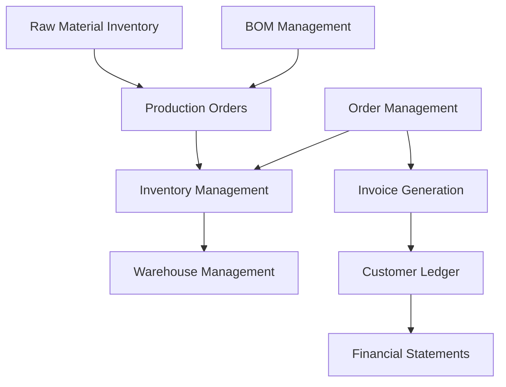
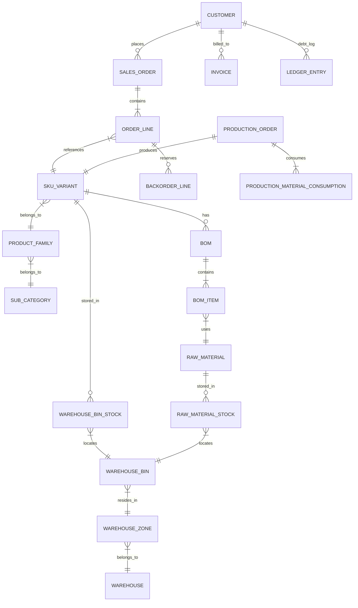

# Hardware Fittings ERP & WMS: System Architecture Specification

This document details the software architecture, database design, integration strategy, and infrastructure layout for the next-generation Hardware Fittings Manufacturing Enterprise Resource Planning (ERP) and Warehouse Management System (WMS). 

---

## 1. MODULE BREAKDOWN (V1 MVP)



### 1. Inventory Management
*   **Purpose**: Manages stock records for Finished Goods (FG) and Work-in-Progress (WIP) items, including stock valuations and reorder alerts.
*   **Dependencies**: None.
*   **Future Expansion**: AI-driven safety stock forecasting and automated stock rotation (FIFO/LIFO) suggestions.

### 2. Warehouse Management (WMS)
*   **Purpose**: Directs physical storage mapping (Zones, Aisles, Shelves, Bins), putaway, item picking routing, and internal stock transfers.
*   **Dependencies**: Inventory Management.
*   **Future Expansion**: Integration with Automated Guided Vehicles (AGVs) and pick-to-light hardware systems.

### 3. Order Management
*   **Purpose**: Handles B2B customer sales orders, credit limit validation, order line item allocation, and shipping updates.
*   **Dependencies**: Inventory Management, Warehouse Management, Customer Ledger.
*   **Future Expansion**: Customer self-service portal, multi-currency pricing, and shipping aggregator API integration (e.g., Shiprocket).

### 4. Raw Material Inventory
*   **Purpose**: Tracks raw materials (zinc alloy, brass rods, powder-coat paints, chemicals) from procurement through receipt and staging.
*   **Dependencies**: Inventory Management.
*   **Future Expansion**: Multi-supplier RFQ automation, supplier quality scoring dashboard.

### 5. BOM Management & Basic Manufacturing
*   **Purpose**: Manages product recipes (BOMs detailing raw material/WIP steps required per finish/size variant) and routing steps.
*   **Dependencies**: Raw Material Inventory.
*   **Future Expansion**: Machine-downtime logging, labor efficiency metrics, and carbon footprint tracking per SKU.

### 6. Production Orders
*   **Purpose**: Schedules, tracks, and logs execution of manufacturing jobs (casting, machining, coating, packing) and updates Finished Goods.
*   **Dependencies**: BOM Management, Raw Material Inventory.
*   **Future Expansion**: IoT sensor connection to die-casting machines for automatic quantity logs.

### 7. Invoice Generation & Customer Ledger
*   **Purpose**: Calculates tax invoices, logs accounts receivable ledger entries, tracks payments, and aging outstanding balances.
*   **Dependencies**: Order Management.
*   **Future Expansion**: Automated SMS/Email payment reminders, e-invoice registration, e-way bill generation, and accounting platform sync (Tally, Zoho).

---

## 2. DATABASE ARCHITECTURE

The system will utilize a relational database (PostgreSQL) optimized for transactional integrity (ACID) and scalable analytical reporting.

### Entity Relationship Diagram (ERD)



### Aggregate Roots & Transaction Boundaries

1.  **Sales Order (Aggregate Root)**
    *   *Boundary*: `SALES_ORDER`, `ORDER_LINE`, `BACKORDER_LINE`.
    *   *Transaction*: Saving an order commits lines and locks `WAREHOUSE_BIN_STOCK` quantities to verify allocation. If stock is insufficient, it triggers `BACKORDER_LINE` creation and returns the allocated amount.
2.  **Production Order (Aggregate Root)**
    *   *Boundary*: `PRODUCTION_ORDER`, `PRODUCTION_MATERIAL_CONSUMPTION`.
    *   *Transaction*: Completing a production order decrements `RAW_MATERIAL_STOCK` (raw material inventory) and increments `WAREHOUSE_BIN_STOCK` (finished goods) in a single atomic transaction.
3.  **Customer Ledger (Aggregate Root)**
    *   *Boundary*: `LEDGER_ENTRY`, `INVOICE`.
    *   *Transaction*: Generating an invoice creates the `INVOICE` record and inserts an outstanding debit transaction in the `LEDGER_ENTRY` table.

---

## 3. API ARCHITECTURE

### REST APIs (Core Endpoints)
*   `POST /api/v1/auth/login` - Authenticates user, returns JWT and user profile.
*   `GET /api/v1/catalog/products` - Paginated product catalog with variants and current ATP stock.
*   `POST /api/v1/orders` - Creates a new sales order.
*   `GET /api/v1/customers/:id/ledger` - Fetches customer outstanding ledger statement.
*   `POST /api/v1/production-orders` - Creates a production run work order.
*   `POST /api/v1/sync` - Bulk sync endpoint for offline mobile clients.

### Authentication Flow
1.  Mobile application requests credentials or biometric pin validation.
2.  Valid credentials request a token via OAuth2 Authorization Code flow with PKCE or direct JSON Web Token (JWT) issuing.
3.  Server issues a short-lived Access Token (15-minute expiration) and a long-lived Refresh Token (30-day expiration, stored in encrypted keyrings).

### Authorization Model (RBAC Policies)
*   **Role-Based Access Control (RBAC)** applied via API gateway middleware.
*   *Implementation*: JWT payload includes the user's role and list of scopes (e.g. `scopes: ["orders:create", "ledger:read"]`).
*   *Validation Check*: Node.js/Java middleware verifies signatures and matches scope mappings before routing to controllers.

### API Versioning Strategy
*   **URI Versioning**: `/api/v1/`, `/api/v2/`.
*   *Rule*: Breaking database changes trigger a new API version. Path-based versioning ensures legacy mobile client builds running older versions continue working during rolling deployment.

---

## 4. MOBILE ARCHITECTURE (OFFLINE-FIRST)

### Navigation Structure
*   **Layout**: Tab-based navigation (Home, Orders/Ledger, Production, Profile).
*   *Deep Linking*: Supports scan-based navigation (scanning a bin barcode automatically takes the user to the Warehouse Bin stock detail screen).

### Offline Sync Engine & Caching Strategy

```
┌──────────────────────────────────────────────────────────────┐
│                    Mobile Sync Service                       │
│                                                              │
│  ┌─────────────────┐       Push       ┌───────────────────┐  │
│  │   Write Queue   │ ───────────────▶ │ Sync API Gateway  │  │
│  │  (Order Drafts) │ ◀─────────────── │  (Delta Bundles)  │  │
│  └─────────────────┘       Pull       └───────────────────┘  │
│           ▲                                     ▲            │
│           │ Local Updates                       │ Sync Job   │
│           ▼                                     ▼            │
│  ┌─────────────────┐                  ┌───────────────────┐  │
│  │ SQLCipher Cache │                  │ ERP Cloud Server  │  │
│  │ (Catalog, Dues) │                  │ (Postgres/Redis)  │  │
│  └─────────────────┘                  └───────────────────┘  │
└──────────────────────────────────────────────────────────────┘
```

1.  **Local Data Storage**: The client utilizes **WatermelonDB** or **SQLite (via SQLCipher)** on the physical device for raw database access.
2.  **Pull Sync Protocol**:
    *   The client requests `GET /api/v1/sync?last_pulled_at=timestamp`.
    *   The server returns only the records modified since that timestamp (delta bundle).
    *   The client applies changes to the local SQLite database.
3.  **Push Sync Protocol**:
    *   Offline mutations (e.g. booked orders) are saved locally with a `pending_sync: true` flag and appended to an outgoing write queue.
    *   When the sync engine detects connectivity, it pushes the queued transactions to `POST /api/v1/sync`.
4.  **Conflict Resolution (Backorder Strategy)**:
    *   If stock is unavailable when the server processes a queued order, the server records the available quantity, registers the remainder as a backorder, updates the order status, and fires a push notification to the sales representative, customer, and warehouse manager.

---

## 5. BACKEND ARCHITECTURE

The backend will employ a **Modular Monolith** structure initially to avoid distributed system complexity, but with clear domain boundaries allowing migration to Microservices in the future.

### Services and Components
*   **API Gateway**: Handles rate limiting, SSL termination, and routing.
*   **Auth Service**: Handles token lifecycle, user registration, and authentication verification.
*   **Core ERP Service**: Processes orders, inventory shifts, manufacturing workflows, and ledger transactions.
*   **WMS Service**: Manages picking/packing queue algorithms, bin allocations, and barcode scans.
*   **Sync Service**: Handles data synchronization requests from offline mobile clients.

### Queues & Background Jobs (Redis / BullMQ)
*   **Order Allocation Queue**: Processes sales orders sequentially, matching inventory to line items, creating backorders if necessary.
*   **PDF Generation Job**: Automatically creates invoice PDF files and uploads them to object storage.
*   **Push Notification Job**: Dispatches alerts on state changes (e.g., "Order #123 contains backordered items").

---

## 6. SECURITY ARCHITECTURE

### Role-Based Access Control (RBAC) Details
Permissions are granularly defined at the model level:
*   `Warehouse Manager`: Read/Write on `WAREHOUSE_BIN_STOCK`, `RAW_MATERIAL_STOCK`, Read-only on `SALES_ORDER`.
*   `Sales Executive`: Read/Write on `SALES_ORDER` (where `created_by` = current user), Read-only on `CUSTOMER` details.

### Cryptographic Storage & Encryption
*   **Data at Rest**: Automated hardware encryption on AWS RDS (AES-256). SQLite database encrypted on the mobile device via SQLCipher.
*   **Data in Transit**: Forced HTTPS with TLS 1.3 protocol for all client-to-server communications.

### Device Registration & JWT Strategy
*   **Device Fingerprinting**: Devices must register on first login. The server stores the Device ID signature.
*   **JWT Revocation**: Since JWTs are stateless, a Redis blocklist is maintained. If a device is reported lost or stolen, its token is blocklisted and rejected on access.

### Audit Log Design
*   Every database mutation is logged in an append-only `SYSTEM_AUDIT_LOG` table:
    *   `Timestamp`, `User_ID`, `Action` (e.g., Update Stock), `Entity_Name`, `Entity_ID`, `Old_Value` (JSON), `New_Value` (JSON), `IP_Address`.

---

## 7. INFRASTRUCTURE & CI/CD ARCHITECTURE

```
                  ┌──────────────────────┐
                  │      Route 53        │
                  └──────────┬───────────┘
                             ▼
                  ┌──────────────────────┐
                  │ Application Load Bal │
                  └──────────┬───────────┘
                             ▼
            ┌──────────────────────────────────┐
            │        ECS Cluster (Fargate)     │
            │  ┌──────────────┐ ┌───────────┐  │
            │  │ ERP Services │ │ Sync Jobs │  │
            │  └──────┬───────┘ └─────┬─────┘  │
            └─────────┼───────────────┼────────┘
                      │               │
         ┌────────────▼───────────────▼───────────┐
         │                                        │
         │   Amazon RDS           Redis Cache     │
         │   (Postgres Master)    (Elasticache)   │
         │                                        │
         └────────────────────────────────────────┘
```

### Cloud Platform & Containerization
*   **Host**: Amazon Web Services (AWS) or Google Cloud Platform (GCP).
*   **Deployment**: Backend services are containerized using **Docker** and orchestrated on **Amazon ECS (Fargate)** or **EKS (Kubernetes)**.

### Database Hosting & Storage
*   **Database**: Amazon RDS for PostgreSQL (Multi-AZ deployment with active read replicas for reports).
*   **Caching**: Amazon ElastiCache for Redis (caching product catalogs, session tokens, and managing processing queues).
*   **Object Storage**: Amazon S3 (used to save generated PDFs, invoices, and product variant images).

### CI/CD Pipeline (GitHub Actions)
1.  *Lint & Test*: Automated checks run unit and integration tests upon merge requests.
2.  *Build*: Docker images are compiled and pushed to Amazon ECR (Elastic Container Registry).
3.  *Deploy*: Automated blue-green rolling deployment triggers updates to Amazon ECS clusters.

---

## 8. SCALABILITY & CONCURRENCY REVIEW

### Scalability Profile
*   **Daily Active Users**: 10,000 active sessions.
*   **Product Catalog**: 100,000 product variant SKUs.
*   **Storage Load**: Daily uploads of images and invoices.

### Bottleneck Identification & Mitigation Strategies

#### 1. Database Lock Contention (Stock Allocations)
*   *Problem*: Thousands of sales orders competing to deduct quantities from the same `WAREHOUSE_BIN_STOCK` rows concurrently will cause transaction timeouts.
*   *Mitigation*: Use Redis-based distributed locks or optimistic lock verification:
    ```sql
    UPDATE warehouse_bin_stock 
    SET quantity = quantity - :allocated 
    WHERE bin_id = :bin_id AND quantity >= :allocated;
    ```
    If rows updated equals 0, fallback to backorder allocation without blocking the database transaction.

#### 2. Sync Request Storms
*   *Problem*: At 9:00 AM, thousands of sales reps open their apps, triggering database queries for delta changes simultaneously.
*   *Mitigation*: Implement aggressive edge-caching using Cloudflare CDN for static catalogs. Use read-replica databases specifically for handling Sync Pull requests, isolating the primary master transactional DB.

#### 3. Image Caching on Mobile Devices
*   *Problem*: Rendering 100,000 product images causes high bandwidth usage and memory crashes.
*   *Mitigation*: Implement dynamic image resizing on the fly (e.g., using Cloudinary or AWS CloudFront image resizing) and use native image caching (FastImage library) on the client application.
